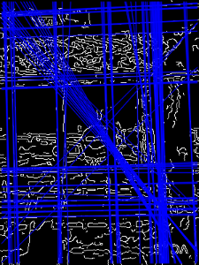

# local-hough-line-cpp

A simple method to detect lines using Hough Transform and testing locality.


## TL;DR

Look at [```LineFinder::runStandardLocalHough()```](https://github.com/helloworldpark/local-hough-line-cpp/blob/876763c3c94a66db57e30bb1d2e31f196039c41b/src/LineFinder.cpp#L61). After running ```cv::HoughLines```, filters the result by locality, i.e. whether the candidate line has any consecutive pixels passing through.


### Xcode users

Just pull the project, and run it. You may change the input image by fixing the ```main.cpp``` file.

  - If you fail to read the image, please try [setting your working directory](https://stackoverflow.com/a/11748111/10464503) to the root directory of the project.


### Others

Didn't write Makefiles yet. Probably will write if there are enough needs.


## Concept

This project aims to find lines more close to reality by measuring **locality**.


### Standard Hough Line Detection

Hough Line Detection relies on [Hough Transform](https://en.wikipedia.org/wiki/Hough_transform) which is mapping each line to ```(rho, theta)``` space, where ```rho``` is the distance from the origin, and ```theta``` is the angle of the line's normal vector. 

Although it is [easy to use](https://docs.opencv.org/4.1.1/dd/d1a/group__imgproc__feature.html#ga46b4e588934f6c8dfd509cc6e0e4545a)(thanks to [OpenCV](https://docs.opencv.org/4.1.1/d9/db0/tutorial_hough_lines.html)) and gives a good result, it sometimes returns too much lines which are in fact won't be recognized as a straight line to human. The reason I thought was that, Standard Hough Line Detection is based on **global** voting scheme. Every pixel on edges votes for every angle, and some of the ```rho```s will get the vote. Finally, the lines will be chosen whose have votes more than the given threshold.

The problem is, ```rho```s can get vote from everywhere on the image.  This may result in finding a 'line' which is in fact not a line. This happens because Standard Hough Line Detection only checks if each pair of ```(rho, theta)``` has votes more than the threshold or not.


### Testing Locality

The remedy I thought was simple: for each candidate from ```cv::HoughLines```, test if there are any connected segments in the line. To be more specific, iterate all the points along the line, and increase a count if it is an edge. If the edge ended, choose whether to reset the count or not: if the count is more than a threshold, keep the value since it means the candidate is at least **locally** a line. If not, reset the count and keep iterating.
```c++
int votes = 0;
for (int i = 0; i < iterator.count; i++, ++iterator) {
    cv::Point pos = iterator.pos();
    bool isPointLine = (*iterator.ptr != 0) || isLine(image, pos);

    if (isPointLine) {
        // Accumulate votes
        ++votes;
    } else {
        // If votes are bigger than threshold
        // Append to line candidate's votes
        // Else
        // Discard
        if (votes > threshold) {
            line[2] += votes;
        }
        votes = 0;
    }
}
```

This method is quite simple, but found that it gives a quite acceptable result. Have a look.

#### Numabukuro Station, Tokyo, Japan

|  |  |  |
|:---:|:---:|:---:|
| Original | Standard Hough | Standard Hough + Locality Test |


#### Pangyo Station, Seong-nam, South Korea

|  |  |  |
|:---:|:---:|:---:|
| Original | Standard Hough | Standard Hough + Locality Test |


#### Gimpo International Airport(GMP), Seoul, South Korea

|  |  |  |
|:---:|:---:|:---:|
| Original | Standard Hough | Standard Hough + Locality Test |


#### Uni Murakami, Hakodate, Japan

|  |  |  |
|:---:|:---:|:---:|
| Original | Standard Hough | Standard Hough + Locality Test |


### Performance

It depends on hardware and the input image, but usually slightly slower than the Standard Hough Line Detection only. Obviously, it becomes even slow if the Hough has found a bunch of lines from the image. Else, it seems to be not that slow.


### Drawbacks

Of course, this method has limitations. 

First, it highly relies on Standard Hough Line Detection. So, it is important to calibrate Hough parameters so that it detects lines well.

Second, it may skip some short lines if its length is smaller than the threshold. 

Third, it is not that robust to errors. In real world's images, the edge detector usually fails to extract the exact edges. So actual line might look to be broken, or wiggled. This can hinder the local line detector's performance.

Fourth, there are very many parameters to calibrate. Including pre-processing, there are 9 parameters that can be controlled in this project.


### Pre-processing

It is very important to pre-process the image so that the edge detector works well. In this project, the pre-processing is done by the following order:

  1. Reduce size
  2. Smooth image using Bilateral Filtering
  3. Grayscale image
  4. Extract edge using Canny Edge Detector
  
All of the pre-processing procedures can be done very easily using OpenCV.


## Contributions

Please do not hesitate to comment on my code, or give a pull request! By the way, the [license is here](LICENSE).


## External Dependencies Used

1. OpenCV 4.1.1


